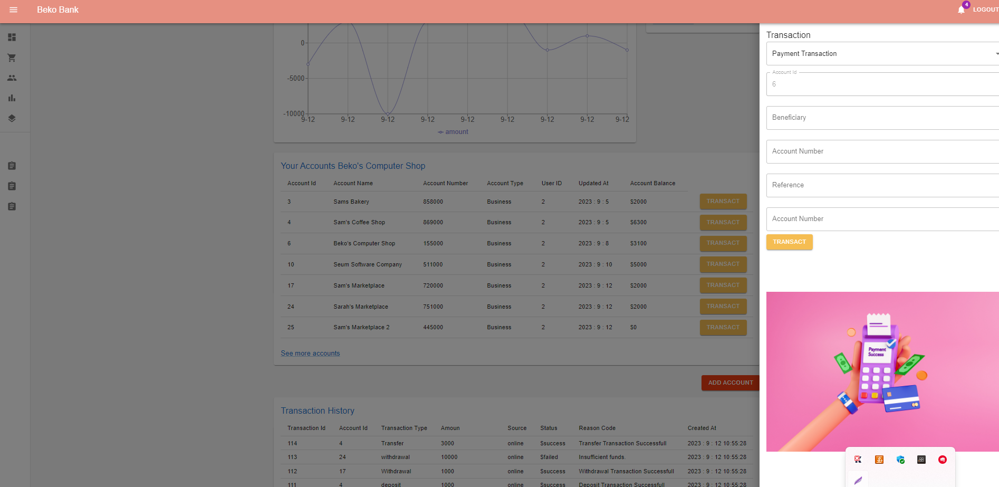

# Online Banking Full Stack Project Frontend

This is a full-stack project. You can access the backend details of the project from the link below. At this point, we will focus on the frontend.

Java Spring Online Banking Rest Api [Java Spring Rest API](https://github.com/Berko01/Advanced-Backend-Project-With-Java-Spring-Online-Banking-Rest-Api)

The application is a frontend project prepared for the Online Banking Rest API. React and Redux are used in the frontend of the application. The project is a single-page application, and I have fully leveraged the benefits provided by Redux. Every component you will see in the project is connected to the Redux Store. When the state of one component changes, all components that need to update their state automatically do so, providing users with real-time information.

Users can register, log in, view their account history, open new accounts, make transfers between accounts, deposit money, withdraw money, and make payments. Additionally, a self-updating chart has been prepared for users to view their account flows. In short, the components are constantly in communication with the backend, ensuring seamless interaction.

A demonstration of the project is available via the following link:

Project Demonstration [LinkedIn](https://www.linkedin.com/feed/)

For further reading on the architecture and the importance of React and Redux used in this project, refer to this article:

Technical Article [React and Redux](https://medium.com/@berkindundar2001/react-nedir-ve-react-redux-neden-%C3%B6nemlidir-4c846d7a5124)

Feel free to reach out if you have any further questions or need additional information regarding the implementation.

## Project Images and Components




## Features

- React and Redux
- Single Page Application
- Material UI

## Distribution

1- Clone the project to your local machine.
2- Build and run the application using your preferred JavaScript environment.

Start for Project

```terminal
  npm install
```

```bash
  npm run start
```

## Technologies

**Language:** JavaScript

**Technologies:**
- React, Redux, Router Dom
- Redux Thunk

## Related projects

You can take a look at the frontends for the React Redux Online Banking App and Android Java Online Banking App projects associated with this application.

Java Spring Online Banking Rest Api [Java Spring Rest API](https://github.com/Berko01/Advanced-Backend-Project-With-Java-Spring-Online-Banking-Rest-Api)

Android Online Banking App: [Android Java Online Banking App](https://github.com/Berko01/Android-Online-Banking-App-With-Java-Spring)

## Extracted Lessons

React, Redux, and Thunk usage. JavaScript implementation. Communication with backend services. CORS Policy Setting. MUI usage. Frontend web development. JWT and cookies management.

## Programmers

- Sachin Yadav - Lead Maintainer
- Berko01 - Original Design and Development

## About the Developer

Sachin Yadav is a Software Developer specializing in building robust full-stack applications. With expertise in React.js, Node.js, and ExpressJs, he focuses on creating seamless user experiences and efficient frontend architectures. His technical toolkit includes C/C++, HTML, CSS, and JavaScript.

- Email: yadavsachin2124@gmail.com
- Role: Software Developer